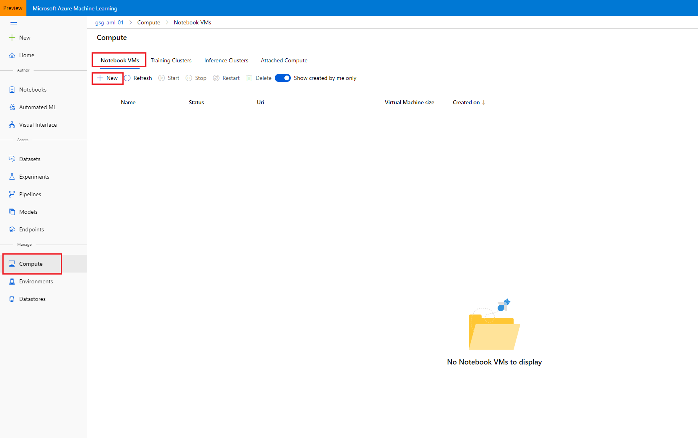
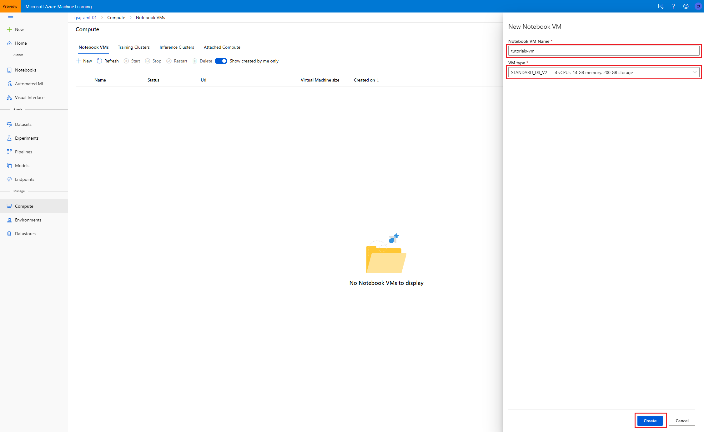
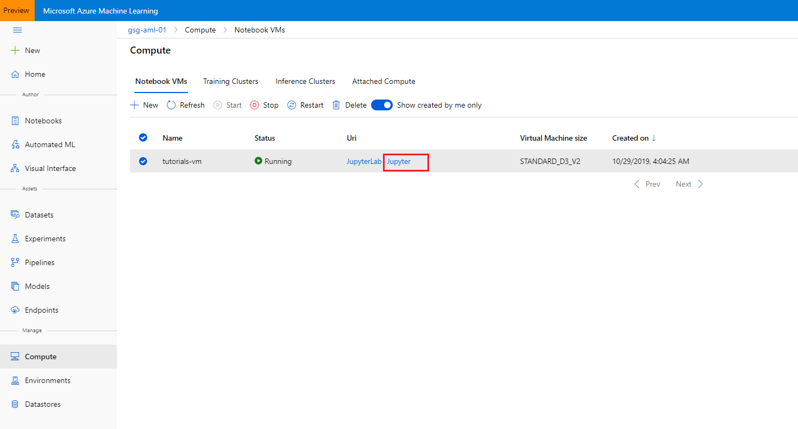
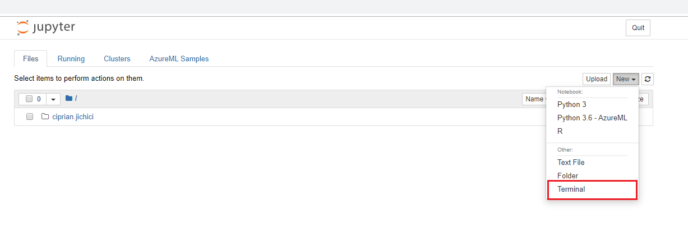

# Azure Machine Learning Notebook Tutorials

These tutorials are provided as Jupyter notebooks and ready to run within your preferred environment. 

Instructions are provided below for running these notebooks using Azure Machine Learning Notebook Virtual Machines.

# Exercise 1: Setting up your environment 

If a lab environment has not be provided for you, this tutorial provides the instructions to get started in your own Azure Subscription.

The tutorials have the following requirements:
- Azure subscription. You will need a valid and active Azure account to complete this Azure lab. If you do not have one, you can sign up for a [free trial](https://azure.microsoft.com/en-us/free/).

## Azure Quotas Required
The tutorials depend on the capability to utilize a certain quantity of Azure resources, for which your Azure subscription will need to have sufficient quota available. 

The following are the specific quotas required, if your subscription does not meet the quota requirements in the region in which you will perform the tutorial, you will need to request a quota increase thru Azure support:

Compute-VM
- Quota: Standard Dv2 Family vCPUs
- Provider: Microsoft.Compute
- SKU family: Dv2 Series
- Required Limit: 6

Compute-VM
- Quota: Total Regional vCPUs
- Provider: Microsoft.Compute
- SKU family: Dv2 Series
- Required Limit: 6

# Prerequisites

- If an environment is provided to you. Use the workspace named: `tutorials-ws-XXXXX`, where `XXXXX` is your unique identifier.

- If you are using your own Azure subscription. Create an Azure Machine Learning service workspace named: `tutorials-ws`. See [Create an Azure Machine Learning Service Workspace](https://docs.microsoft.com/en-us/azure/machine-learning/service/setup-create-workspace) for details on how to create the workspace.

# Exercise 2: Azure Notebook Virtual Machines Setup

At a high level, here are the setup tasks you will need to perform to prepare your Azure Notebook VM Environment (the detailed instructions follow):

1. Create a Notebook VM in your Azure subscription.

2. Import the Tutorial Notebooks.

3. Update your Notebook Environment. 

## Task 1: Create a Notebook VM

1. Log into [Azure Portal](https://portal.azure.com/) and open the machine learning workspace: tutorials-ws-XXXXX or tutorials-ws.

2. Select **Notebook VMs** in the left navigation and then select **New**.

   

3. Provide Name: `tutorials-vm` and Virtual machine size: `STANDARD_D3_V2` and then select **Create**.

   
  
4. Wait for the VM to be ready, it will take around 5-10 minutes.

## Task 2: Import the Tutorial Notebooks

1. Select the Notebook VM: **tutorials-vm** and then select **Jupyter** open icon, to open Jupyter Notebooks interface.

   

2. Select **New, Terminal** as shown to open the terminal page.

   
  
3. Run the following commands in order in the terminal window:

   a. `mkdir tutorials`
   
   b. `cd tutorials`
   
   c. `git clone https://github.com/solliancenet/aml-notebook-tutorials.git`
   
   d. Wait for the import to complete.

# Exercise 3: Complete the Tutorials

1. From the Jupyter Notebooks interface, navigate to the `tutorials` folder where you will find all your tutorial files.

2. Open the desired notebook.

3. Follow the instructions within the notebook to complete the tutorial.